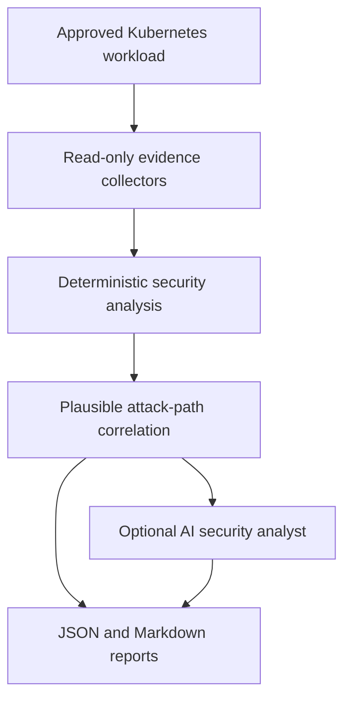

# Kubernetes Security Triage Agent

A read-only, evidence-grounded Kubernetes security scanner that correlates workload misconfigurations, RBAC risk, network exposure, and image vulnerabilities into prioritized attack paths with optional AI analysis.

Kubernetes is production infrastructure for 82% of container users surveyed by CNCF, so a workload weakness can become a business risk rather than an isolated configuration issue. In Red Hat's Kubernetes security survey, 67% of respondents said security concerns delayed or slowed deployment, while 46% reported revenue or customer loss after a container or Kubernetes security incident. This project helps teams shorten that triage cycle by turning several disconnected security signals into one traceable, prioritized report. ([CNCF Annual Cloud Native Survey 2025](https://www.cncf.io/announcements/2026/01/20/kubernetes-established-as-the-de-facto-operating-system-for-ai-as-production-use-hits-82-in-2025-cncf-annual-cloud-native-survey/), [Red Hat State of Kubernetes Security 2024](https://www.redhat.com/en/resources/kubernetes-adoption-security-market-trends-overview))

## Project status

- ✅ Live Kind demo validated against secure and intentionally vulnerable workloads
- ✅ `189` automated tests passing
- ✅ Read-only Kubernetes access enforced in both the CLI and demo RBAC
- ✅ Deterministic, schema-validated JSON and Markdown reports
- ✅ Optional OpenAI analysis validated successfully

## Demo results

The latest live run on **August 29, 2026** scanned two Deployments in a local Kind cluster through the restricted scanner ServiceAccount.

| Target | Status | Confirmed results | Plausible attack paths |
| --- | --- | --- | ---: |
| `secure-demo/secure-web` | `COMPLETE` | **0 findings**: no confirmed Kubernetes misconfigurations and **0 matching Critical/High CVEs** | 0 |
| `vulnerable-demo/vulnerable-web` | `COMPLETE` | **174 findings**: **39 Critical**, **127 High**, **1 Medium**, and **7 Low** | 3 |

The vulnerable workload confirmed **166 Critical/High image vulnerability findings** plus **8 Kubernetes configuration findings**: privileged execution, UID `0`, explicit root permission, privilege escalation, dangerous Linux capabilities, Secret-reading RBAC, no matching NetworkPolicy, and NodePort-based potential external exposure.

Optional AI analysis was also validated with status `SUCCESS` in a separate operator run. AI output did not replace or modify deterministic findings.

> A NodePort is evidence of **potential** external exposure. The scanner does not claim that public reachability, compromise, or exploitation was confirmed.

Vulnerability totals are a point-in-time result and will change as Trivy's vulnerability database changes.

## Architecture

The Kubernetes Security Triage Agent follows an evidence-first pipeline. Kubernetes configuration and image data are collected through restricted, read-only interfaces before any security conclusion is produced.



### Processing flow

1. **Target validation** requires an explicit namespace, workload kind, and workload name.
2. **Evidence collection** inspects the workload, SecurityContext, Services, Ingresses, NetworkPolicies, RBAC permissions, and Trivy image results.
3. **Deterministic analysis** creates confirmed findings using fixed rules, validated evidence, stable identifiers, and configured risk scores.
4. **Attack-path correlation** combines related confirmed findings into plausible paths without claiming exploitation occurred.
5. **AI analysis** optionally explains and prioritizes existing findings. It cannot create findings, change scores, or access the cluster.
6. **Reporting** produces schema-validated JSON and concise Markdown while clearly separating facts, plausible paths, and AI interpretation.

### Core components

| Component | Responsibility |
| --- | --- |
| Kubernetes workload collector | Retrieves the explicitly approved workload and normalized pod specification |
| SecurityContext collector | Inspects container privileges, user identity, capabilities, seccomp, and host namespace settings |
| Exposure collector | Evaluates Services and Ingresses using conservative exposure classifications |
| NetworkPolicy collector | Determines declared ingress and egress isolation |
| RBAC collector | Resolves effective ServiceAccount permissions and binding provenance |
| Trivy collector | Scans workload images and normalizes vulnerability evidence |
| Deterministic analyzers | Produce repeatable, evidence-backed security findings |
| Correlation engine | Builds evidence-linked, plausible attack paths |
| AI analyst | Explains and prioritizes existing results through structured output |
| Report generator | Produces validated JSON and human-readable Markdown reports |

## Detection coverage

| Area | What is evaluated | Example signals |
| --- | --- | --- |
| SecurityContext | Pod- and container-level runtime controls, including inherited settings | Privileged containers, root execution, privilege escalation, dangerous capabilities, host namespaces, and missing seccomp |
| RBAC | Effective permissions of the workload ServiceAccount and the bindings that grant them | Secret reads, pod exec, namespace administration, cluster-admin bindings, and RBAC escalation permissions |
| NetworkPolicy | Declared ingress and egress isolation for the selected workload | No matching policy, missing ingress isolation, and missing egress isolation |
| Service and Ingress exposure | Services and Ingresses that select the target workload | Internal, potentially external, confirmed external, or unknown exposure; NodePort remains conservative |
| Trivy vulnerabilities | Vulnerabilities in each normalized workload image | CVE, package, installed version, fixed version, image digest, and scanner severity |
| Attack-path correlation | Related confirmed findings on the same workload | Exposure plus a high-impact CVE, privileged/root execution, or missing network isolation |

Rules and risk weights are deterministic and versioned in [`config/risk-rules.yaml`](config/risk-rules.yaml). Identical normalized evidence produces identical findings, scores, and stable identifiers.

## Safety boundaries

The scanner is intentionally designed for triage, not penetration testing or remediation.

| Boundary | Enforcement |
| --- | --- |
| No Kubernetes mutations | The CLI exposes only allowlisted `get`, `list`, and `read` client methods; demo RBAC omits `create`, `update`, `patch`, and `delete` |
| No Secret values | Secret resources and Secret data are outside the collector surface; RBAC analysis inspects permission declarations only |
| No pod exec or logs | The scanner cannot call `pods/exec`, `pods/log`, port-forwarding, or other runtime access paths |
| Explicit namespace allowlist | `--namespace` must exactly match `--allowed-namespace`; every collector also receives the approved namespace |
| Fixed Trivy commands | Image references and severities are validated, argument lists are fixed, `shell=False`, and no model or caller can add arbitrary flags |
| No AI tool access | The AI adapter has no Kubernetes client or subprocess interface and sends `tools=[]` with `tool_choice="none"` |
| Fail-closed behavior | Missing evidence, collector errors, analyzer errors, invalid schemas, unsafe AI claims, or unknown AI references produce explicit partial/failed states—not a clean result |

The complete behavioral contract is documented in [`docs/security-contract.md`](docs/security-contract.md).

## Fact-versus-hypothesis design

The report keeps evidence, correlation, and interpretation at three distinct authority levels:

| Level | Meaning |
| --- | --- |
| Confirmed finding | Directly supported by collected evidence |
| Plausible attack path | Deterministic correlation of confirmed conditions |
| AI interpretation | Explanation and prioritization only |

Only deterministic rules create findings, scores, and severities. Correlation can show how confirmed conditions may combine, but it cannot establish that an attacker can reach or exploit the workload. AI can reference existing finding and attack-path IDs; it cannot invent evidence, change severity, or confirm an incident.

## Quickstart

### Prerequisites

- Docker with a running daemon
- Kind, `kubectl`, and Trivy on `PATH`
- Python 3.11 or newer

Create the local environment once:

```bash
python3 -m venv .venv
source .venv/bin/activate
python -m pip install \
  "jsonschema==4.26.0" \
  "kubernetes==36.0.3" \
  "PyYAML==6.0.3" \
  "pytest==9.1.1"
```

Then run the complete local demo:

```bash
source .venv/bin/activate
./demo/preflight.sh
./demo/setup.sh
./demo/create-scanner-kubeconfig.sh
./demo/run-demo.sh
```

Reports are written to `demo/reports/secure-demo/` and `demo/reports/vulnerable-demo/`. Generated reports and the short-lived scanner kubeconfig are intentionally ignored by Git.

### Optional AI analysis

Install the optional client, export the key only in the current shell, and run the vulnerable scan into a separate output directory:

```bash
python -m pip install "openai==3.5.0"
export OPENAI_API_KEY="your-api-key"
export OPENAI_MODEL="gpt-5-mini"

KUBECONFIG=demo/.generated/scanner.kubeconfig \
python -m src.cli scan \
  --namespace vulnerable-demo \
  --allowed-namespace vulnerable-demo \
  --kind Deployment \
  --name vulnerable-web \
  --output-dir demo/reports/vulnerable-demo-ai \
  --trivy-severity CRITICAL,HIGH \
  --fail-on none \
  --ai
```

Do not commit API keys, generated kubeconfigs, or raw runtime reports.

Cleanup is explicit and never runs automatically:

```bash
./demo/cleanup.sh
```

## Example report

One Critical finding from the latest vulnerable-workload scan:

```text
KSA-019343407670  CRITICAL  score=80  confidence=high
CVE-2020-36330 affects libwebp6 in nginx:1.16.1

Evidence: Trivy found libwebp6 0.6.1-2 in image digest
sha256:d20aa6d1... with fixed version 0.6.1-2+deb10u1.
Limitation: the package match does not prove runtime reachability or exploitability.
```

One correlated path from the same scan:

```text
KAP-a4b87e1a0758  HIGH  PLAUSIBLE
External exposure combines with privileged or root execution.

Evidence link: potential_external_exposure + privileged_container + runs_as_root
Limitation: NodePort is potentially external; public reachability and exploitation
were not confirmed.
```

See the compact, sanitized report snapshots in [JSON](docs/samples/vulnerable-scan-report.json) and [Markdown](docs/samples/vulnerable-scan-report.md). Complete runtime reports remain local because they can contain environment-specific evidence.

## Testing

```text
189 tests passed
```

Run the suite with:

```bash
source .venv/bin/activate
python -m pytest -q
```

Coverage includes:

- collectors for workloads, SecurityContext, exposure, NetworkPolicy, RBAC, and Trivy
- deterministic rule engines, scoring, deduplication, and correlation
- JSON Schema validation for findings, attack paths, AI output, and complete reports
- partial scans, collection failures, analysis failures, malformed scanner output, timeouts, and CLI exit behavior
- prompt-injection containment, disabled AI tools, bounded inputs, and sanitized errors
- AI schema, reference, incident-language, and deterministic-data-preservation validation
- end-to-end collector-to-analyzer integration plus separate live Kind and Trivy validation

## Repository structure

```text
src/
├── collectors/
├── analysis/
├── ai/
├── models/
└── reporting/

schemas/
tests/
demo/
docs/
```

## Limitations

- NetworkPolicy findings evaluate declared policy. Runtime enforcement depends on the cluster's CNI and its NetworkPolicy support.
- A NodePort indicates potential external exposure; it does not prove that routing, firewalls, security groups, or public IPs make the workload publicly reachable.
- Trivy results depend on the vulnerability database available at scan time, so counts and severities can change.
- The system identifies configuration and vulnerability risk; it does not confirm access, exploitation, compromise, or business impact.
- AI analysis is non-authoritative and requires operator review before remediation decisions.

## Cleanup

Delete the local Kind cluster, generated scanner credential, and runtime reports with:

```bash
./demo/cleanup.sh
```

## License

Licensed under the [MIT License](LICENSE).
